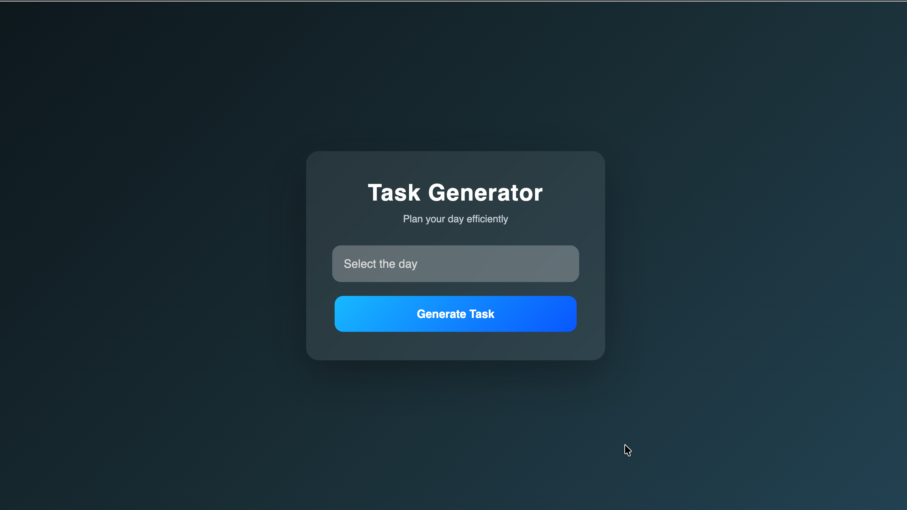
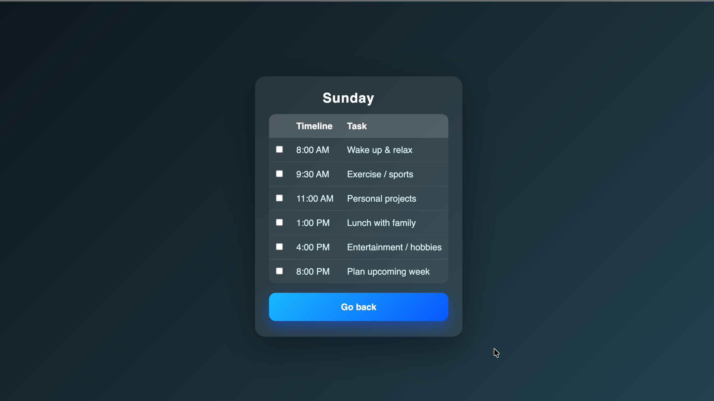

<p align="center">
  
</p>

<p align="center">
  
</p>

---

# 🚀 The Ultimate Productivity Companion

A **modern, fast, and beautifully designed To-Do List App** built using **HTML, CSS, and JavaScript**.

This project focuses on **clean UI**, **smooth interactions**, and **efficient task management** — proving that powerful apps don’t always need heavy frameworks.

> ⚡ _Simple tools executed perfectly create extraordinary results._

---

# 🔥 Live Preview

⭐ **Experience the website live here:**  
👉 https://to-do-list-ashy-chi-65.vercel.app/

⭐ **Read the Linkden Post:**  
👉 https://www.linkedin.com/feed/update/urn:li:activity:7427977115637104640/

## 🌟 Minimal • Elegant • Powerful

<p align="center">
  
</p>

---

## ⚡ Built For Focus & Speed

<p align="center">
  
</p>

---

# 📂 Project Structure

```
to-do-list
│
├── index.html
├── style.css
├── script.js
│
└── images/
     ├── preview-1.png
     └── preview-2.png
```

---

## ⚙️ Local Setup

### Option 1: Clone the Repository

```bash
git clone https://github.com/Akash-Wakade-7008-alt/To-do-list.git

cd TO-DO-LIST

open index.html

```

### 📦 Option 2: Download ZIP File

Download the project directly:  
👉 https://github.com/Akash-Wakade-7008-alt/To-do-list/releases/download/TO-DO-LIST/To-do-list.zip

1. Download the ZIP file
2. Extract it
3. Open `index.html` in your browser

---

# 🛠️ Tech Stack

| Tech       | Purpose       |
| ---------- | ------------- |
| HTML5      | Structure     |
| CSS3       | Styling       |
| JavaScript | Functionality |

---

# ✨ Why This Project Stands Out

✅ Lightning-fast interface  
✅ Distraction-free design  
✅ Zero dependencies  
✅ Fully responsive  
✅ Clean architecture  
✅ Beginner-friendly yet impressive

💡 **This is the type of project recruiters LOVE — simple, polished, and functional.**

---

# 🧠 Skills Demonstrated

🔥 DOM Manipulation  
🔥 Event Handling  
🔥 UI/UX Fundamentals  
🔥 Responsive Design  
🔥 Clean Code Practices

👉 This project reflects **real developer thinking**, not tutorial copying.

---

# 🚀 Future Upgrades

⭐ Local Storage  
⭐ Dark Mode 🌙  
⭐ Drag & Drop  
⭐ Task Categories  
⭐ Priority Labels  
⭐ Due Dates  
⭐ Cloud Sync

> 🔥 Turning this into a full productivity system.

---

# 📈 Developer Growth Indicator

💡 Projects like this show:

✔ You understand JavaScript  
✔ You can build UI  
✔ You can structure apps  
✔ You are beyond beginner level

---

# 🤝 Contributing

Want to improve it?

Fork 🍴  
Build 🔨  
Pull Request 🚀

Let's grow together!

---

# ⭐ If You Like This Project...

Drop a star ⭐  
It motivates me to build even bigger things!

---

# 👨‍💻 Author

## **Akash Wakade**

🎓 B.Tech CSE (AI)  
🚀 Future Software Engineer  
🔥 Passionate Web Developer

> _"Great developers are not born — they build daily."_
